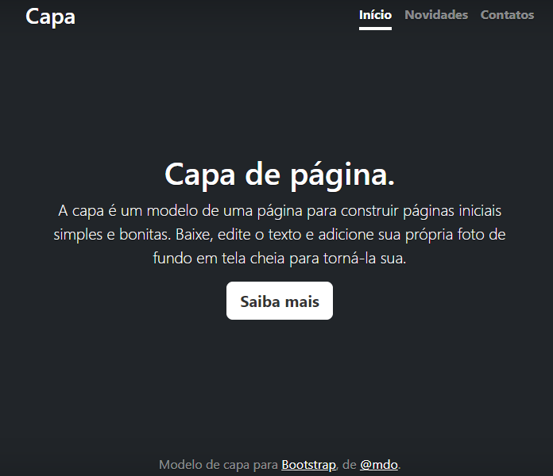

# Índice

[Descrição](#descri%C3%A7%C3%A3o)  

[Funcionalidades](#funcionalidades)  

[Tecnologia ultilizadas](#tecnologia-ultilizadas)  

[Fontes consultadas](#fontes-consultadas)

[https://github.com/](#httpsgithubcom)

[Autores](#autores)  

 

# 🚀 Projeto - Portifólio para escrita do README

## 📋Descrição
Projeto em desenvolvimento para disciplina de Programação Web I. Estamos aprendendo a utilizar recursos do Bootstrap para facilitar a criação de  layouts, formulários e outros componentes com apenas algumas linhas de código.

## 🔧 Funcionalidades
- `Funcionalidade 1`: A tela inicial é a primeira que o usuário vê quando abre a página, ela apresenta um layout de introdução ao aplicativo.
- `Funcionalidade 2`: A tela de novidades abriga todas as atualizações da página.
- `Funcionalidade 3`: Tela de contatos para que os usuários entrem em contato com o desenvolvedor.

### 🛠️ Tecnologia ultilizadas
HTML
CSS
BOOTSTRAP

## 📄 Fontes consultadas
https://www.alura.com.br/artigos/escrever-bom-readme#descri%C3%A7%C3%A3o-do-projeto
https://gist.github.com/lohhans/f8da0b147550df3f96914d3797e9fb89
v

## ✒️ Autores